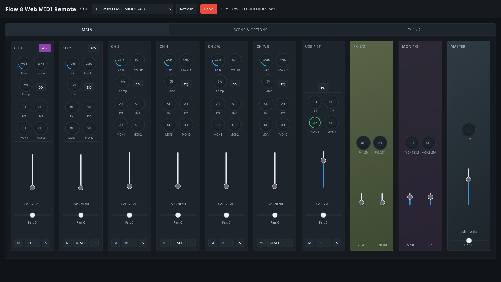

# Flow 8 Web MIDI Control

An experiment in AI prompt-driven development of a browser-based MIDI control surface for 
[Behringer Flow 8] digital mixers

## Usage

Connect the Flow 8 via USB to your computer and turn it on. Run a local HTTP(S) server (e.g.
[httplz] on a free port, e.g. 8000) serving the root directory of this repository and open a
browser at e.g. `http://localhost:8000/`.

Or you can use the latest version deployed at:

    https://spotlightkid.github.io/flow8-web-midi-control/

The Flow 8 MIDI device should be detected automatically and the browser will ask your confirmation
for accessing MIDI devices.

## Screenshot

## Bugs and Limitations

The software is still in beta stage and there are some known and unknown bugs and some features
missing.

* The browser, in which you use this web app, must run on the device, which is connected to the
  Flow 8 via USB, and it must support Web MIDI.
  If you want to use it on a tablet or phone, it needs to support class-compliant USB MIDI devices,
  and you'll probably need an OTG-adapter.
* Full HD screen recommended.
* No MIDI feedback (not supported by the hardware).
* No value pick-up, so levels may jump from current value set in hardware to the value set via MIDI
  (the hardware does not support value pick-up mode via MIDI).
* Some (quite a few) settings can not be set via MIDI, only via the BT (mobile app) or on the
  hardware itself.
* Saving app state snapshots in local browser storage is untested.
* Some UI layout errors (e.g. small faders).
* Master / FX 1/2 / MON 1/2 EQ controls not yet implemented.
* FX parameters have generic names (to be done).
* Restoring mixer state from hardware via MIDI dump not yet implemented.

## Author

This software was created by *Christopher Arndt* with the assistance of GPT-5.

## License

This project is released under the *MIT* license. Please see the [LICENSE.md](./LICENSE.md) file 
for details.

[Behringer Flow 8]: https://www.behringer.com/product.html?modelCode=0603-AEW
[httplz]: https://github.com/thecoshman/http
